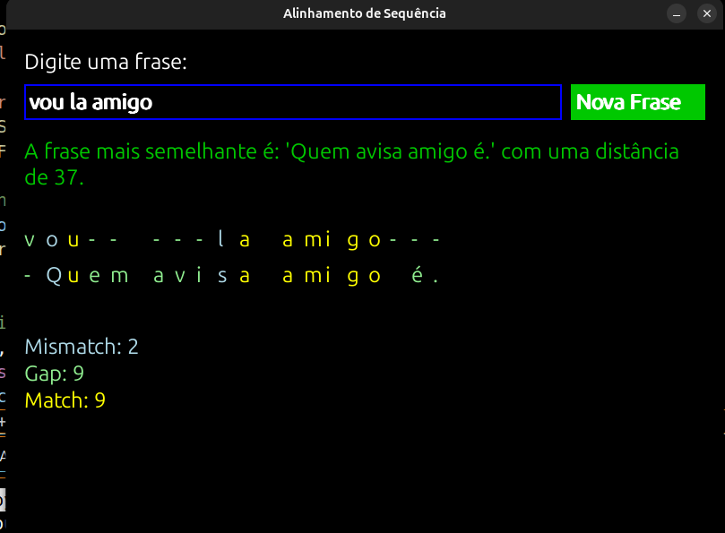

# Alinhamento de Sequências de Frases 📍

## Temas:
- Algoritmos de Alinhamento de Sequências

## Alunos
| Matrícula  | Aluno                                   |
|------------|-----------------------------------------|
| 19/0048760 | Wellington Jonathan de Souza Rodrigues  |
| 20/2063346 | José Filipi Brito Souza                 |

## Sobre

Este projeto utiliza a biblioteca Pygame para criar uma interface gráfica que permite comparar a frase que você insere com uma lista de frases pré-definidas. O algoritmo de alinhamento de sequência é utilizado para compara a frase do usuário com as frases da lista e mostra o alinhamento com cores diferenciadas para gaps e mismatches e match.

A interface gráfica exibe o alinhamento de sequência após o usuário pressionar ENTER e fornece estatísticas sobre a quantidade de mismatches, gaps e matches. Também há um botão que permite ao usuário limpar a entrada e digitar uma nova frase.

O código está estruturado em funções que:
- Calculam o alinhamento de sequência entre duas frases.
- Reconstruem e colorizam o alinhamento.
- Encontram a frase mais semelhante na lista.
- Gerenciam a interface gráfica usando Pygame.

## Funcionalidades
- **Entrada de Frase**: Permite ao usuário digitar uma frase em uma caixa de texto.
- **Análise de Similaridade**: Após pressionar ENTER, encontra a frase mais semelhante na lista predefinida.
- **Visualização de Alinhamento**: Exibe o alinhamento de sequência com cores diferentes para correspondências (amarelo), gaps (verde claro) e mismatches (azul claro).
- **Estatísticas de Alinhamento**: Mostra contagens de mismatches, gaps e matches.
- **Nova Entrada**: Um botão permite ao usuário limpar a entrada e inserir uma nova frase.

## Screenshots
### Tela do Programa


## Instalação
**Linguagem**: Python 3.x  
**Bibliotecas**: pygame & numpy (pip install pygame & pip install numpy)

### Pré-requisitos
Certifique-se de ter o Python 3.x instalado em sua máquina.

### Comandos de Instalação

1. Clone o repositório:
   ```bash
   git clone 